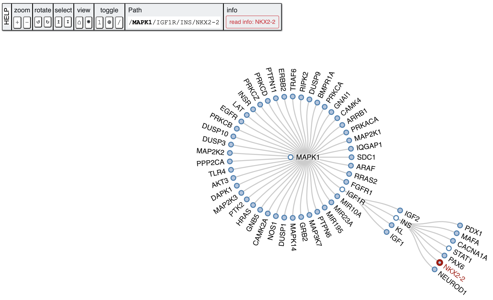

# PETAL (ParallEl paThways AnaLyzer)
tuerie


PETAL software is written in the Python 3 programming language. It contains a set of tools for pathway analysis and discovery of novel therapeutic targets. The approach allows you to scan and perform a in-depth search of the biological pathway to analyze less recurrent pathways, detect nodes that are far from the initial target nodes and showing the pathway of origin from which it was taken the gene.



---

## Publications
#### Please cite our paper if you want to use PETAL for your research.

#### DOI: [10.1093/bioinformatics/btaa1032](https://doi.org/10.1093/bioinformatics/btaa1032)

#### BibTex format
```
@article{10.1093/bioinformatics/btaa1032,
    author = {Sgroi, Giuseppe and Russo, Giulia and Pappalardo, Francesco},
    title = "{PETAL: a python tool for deep analysis of biological pathways}",
    journal = {Bioinformatics},
    year = {2020},
    month = {12},
    abstract = "{Although several bioinformatics tools have been developed to examine signaling pathways, little attention has been given to ever long-distance crosstalk mechanisms. Here, we developed PETAL, a Python tool that automatically explores and detects the most relevant nodes within a KEGG pathway, scanning and performing an in-depth search. PETAL can contribute to discovering novel therapeutic targets or biomarkers that are potentially hidden and not considered in the network under study.PETAL is a freely available open-source software. It runs on all platforms that support Python3. The user manual and source code are accessible from https://github.com/Pex2892/PETAL.}",
    issn = {1367-4803},
    doi = {10.1093/bioinformatics/btaa1032},
    url = {https://doi.org/10.1093/bioinformatics/btaa1032},
    note = {btaa1032},
    eprint = {https://academic.oup.com/bioinformatics/advance-article-pdf/doi/10.1093/bioinformatics/btaa1032/34926045/btaa1032.pdf},
}
```

---

# _Documentation_

- [Installation](#installation)
  - [Download zip](#download-zip)
  - [Clone repository](#clone-repository)
- [Setting Environment](#setting-environment)
- [Run](#run)
- [Viewing the results](#viewing-the-results)
- [Filtering the results](#filtering-the-results)
  - [Single target](#single-target)
  - [Multi target](#multi-target)
- [Common errors](#common-errors)
  - [certificate verify failed](#certificate-verify-failed)
  - [bz2 error](#bz2-error)
  - [lzma error](#lzma-error)


---

## Installation

### Download zip
```bash
wget https://github.com/Pex2892/PETAL/archive/master.zip
unzip PETAL-master.zip
```
or
### Clone repository
```bash
git clone https://github.com/Pex2892/PETAL.git
```

---

## Setting Environment
A typical user can install the libraries using the following command:
``` bash
python3 -m pip install -r requirements.txt
```

---

# Run
You can test that you have correctly installed the PETAL 
by running the following command:
```bash
python3 main.py -m <mode> -p <pathway> -g <gene> -d <depth> -c <CPUs>
```

Before starting the breadth analysis, PETAL requires the setting of five mandatory and optional input parameters:
>- __Mode__ (-m or --mode): if it is set to 0, the entire analysis will start; if it is equal to 1, the analysis will be extended to the new maximum depth considered;
>- __Pathway__ (-p or --pathway): represents the biological pathway (in hsa format) from which the analysis will start (e.g., hsa04010);
>- __Gene__ (-g or --gene): represents the starting gene present in the selected pathway. If the inserted gene is not detected in the biological pathway, the analysis will fail (e.g., MAPK1);
>- __Depth__ (-d or --depth): indicates the maximum search depth of the analysis;
>- __CPUs__ (-c or --cpu): indicates the maximum number of CPUs used during the analysis. If it is set to 0 or its value exceeds the number of installed CPUs, the analysis will be automatically set to the maximum number.

---

# Viewing the results
After PETAL has finished the analysis, to view the final output generated you need to run the following commands:
```bash
cd export_data/demo_radialtree/
python3 -m http.server 8080 --bind 127.0.0.1
```
After starting the local server, now you can open the browser with the url http://127.0.0.1:8080/, so the PETAL GUI will be shown.

This method it has been tested on both Firefox, Chrome and Safari.

---

# Filtering the results
You can filter the results obtained based on a target gene.
```bash
python3 filter.py -t <target>
```

Before filtering the results, PETAL requires an input parameter:

>- __Target__ (-t or --gtarget): represents the target gene to be found in the results obtained during the analysis (e.g., AKT3)

## Single target
You can filter the results by passing a single target gene. For example:
```bash
python3 filter.py -t AKT3
```

## Multi target
Or you can filter the results by passing multiple target genes, as long as they are separated by commas. For example:
```bash
python3 filter.py -t MAPK1,EGFR
```
If one of the targets is not found, an on-screen message will be returned while execution continues.

---

# Common errors

## _certificate verify failed_
If at the first run of PETAL on Mac OS, the following error occurs:
>urllib.error.URLError: <urlopen error [SSL: CERTIFICATE_VERIFY_FAILED] certificate verify failed

You can try to solve in two ways:
1) Via PIP:
```bash
pip3 install --upgrade certifi
```
2) If it doesn't work, try to run a Cerificates.command that comes bundled with Python 3.x for Mac:
```bash
open /Applications/Python\ 3.9/Install\ Certificates.command
```
One way or another, you should now have certificates installed, and Python should be able to connect via HTTPS without any issues.


## _bz2 error_
When trying to execute the python script, if the following error occurs:

>from _bz2 import BZ2Compressor, BZ2Decompressor ImportError: No module named '_bz2'


You need to install libbz2 and .so files, so that python will be compiled with bz2 support.
```bash
sudo apt install libbz2-dev  # on ubuntu/debian or
sudo yum install bzip2-devel # on fedora

cp /usr/lib/python3.8/lib-dynload/_bz2.cpython-38m-x86_64-linux-gnu.so  /usr/local/lib/python3.8/
```

## _lzma error_
When trying to execute the python script, if the following error occurs:

>UserWarning: Could not import the lzma module. Your installed Python is incomplete. 
Attempting to use lzma compression will result in a RuntimeError.

You need to install liblzma and .so files, so that python will be compiled with lzma support.
```bash
sudo apt install liblzma-dev  # on ubuntu/debian or
sudo yum install -y xz-devel  # on fedora

cp /usr/lib/python3.8/lib-dynload/_lzma.cpython-38m-x86_64-linux-gnu.so /usr/local/lib/python3.8/
```
