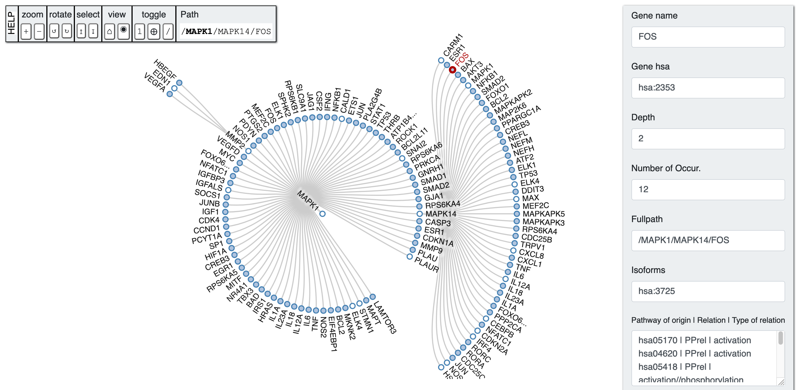

# PETAL (ParallEl paThways AnaLyzer)

---
 <p xmlns:dct="http://purl.org/dc/terms/" xmlns:cc="http://creativecommons.org/ns#"><a rel="cc:attributionURL" property="dct:title" href="https://github.com/Pex2892/PETAL">PETAL</a> by <a rel="cc:attributionURL dct:creator" property="cc:attributionName" href="https://github.com/Pex2892">Giuseppe Sgroi</a> is licensed under <a rel="license" href="https://creativecommons.org/licenses/by-nc-sa/4.0?ref=chooser-v1" target="_blank" rel="license noopener noreferrer" style="display:inline-block;">CC BY-NC-SA 4.0<br />
</a></p> 

---
PETAL software is written in the Python 3 programming language. It contains a set of tools for pathway analysis and discovery of novel therapeutic targets. The approach allows you to scan and perform a in-depth search of the biological pathway to analyze less recurrent pathways, detect nodes that are far from the initial target nodes and showing the pathway of origin from which it was taken the gene.



---
## Publications
### Please cite our paper if you want to use PETAL for your research.

#### DOI: [10.1093/bioinformatics/btaa1032](https://doi.org/10.1093/bioinformatics/btaa1032)

#### BibTex format
```
@article{10.1093/bioinformatics/btaa1032,
    author = {Sgroi, Giuseppe and Russo, Giulia and Pappalardo, Francesco},
    title = "{PETAL: a python tool for deep analysis of biological pathways}",
    journal = {Bioinformatics},
    year = {2020},
    month = {12},
    abstract = "{Although several bioinformatics tools have been developed to examine signaling pathways, little attention has been given to ever long-distance crosstalk mechanisms. Here, we developed PETAL, a Python tool that automatically explores and detects the most relevant nodes within a KEGG pathway, scanning and performing an in-depth search. PETAL can contribute to discovering novel therapeutic targets or biomarkers that are potentially hidden and not considered in the network under study.PETAL is a freely available open-source software. It runs on all platforms that support Python3. The user manual and source code are accessible from https://github.com/Pex2892/PETAL.}",
    issn = {1367-4803},
    doi = {10.1093/bioinformatics/btaa1032},
    url = {https://doi.org/10.1093/bioinformatics/btaa1032},
    note = {btaa1032},
    eprint = {https://academic.oup.com/bioinformatics/advance-article-pdf/doi/10.1093/bioinformatics/btaa1032/34926045/btaa1032.pdf},
}
```

---
## How to Contribute
To report PETAL bugs or request features, please file an [issue directly using Github](https://github.com/Pex2892/PETAL/issues). 
If you wish to make any contributions, please [issue a Pull Request on Github](https://github.com/Pex2892/PETAL/pulls).

---
## Installation
### Download the PETAL repository:

```bash
git clone https://github.com/Pex2892/PETAL.git
```

### Dependencies

PETAL depends on the following libraries:

*   pandas, joblib, requests and beautifulsoup4

A typical user can install the libraries using the following command:

``` bash
pip3 install -r requirements.txt
```

---

# Testing the Installation

You can test that you have correctly installed the PETAL 
by running the following command:

```bash
python3 main.py
```
After completing an analysis, to view the final output just open the index.html file located in the "demo" folder.

---
## How to resolve the common errors

### "index.html" blank
You cannot do Ajax calls locally (file://). You can use the built-in python server in your project directory. Running from a console:
```sh
$ cd petal-dir/demo/
$ python3 -m http.server 9090
```
Now you can open the browser with the URL:
```sh
$ http://localhost:9090/
```

---

### bz2 error 
When trying to execute the python script, if the following error occurs:

```bash
from _bz2 import BZ2Compressor, BZ2Decompressor ImportError: No module named '_bz2'
```

You need to install libbz2 and .so files, so that python will be compiled with bz2 support.
```bash
sudo apt install libbz2-dev  # on ubuntu/debian or
sudo yum install bzip2-devel # on fedora

cp /usr/lib/python3.7/lib-dynload/_bz2.cpython-37m-x86_64-linux-gnu.so  /usr/local/lib/python3.7/
```

---

### lzma error 
When trying to execute the python script, if the following error occurs:

```bash
UserWarning: Could not import the lzma module. Your installed Python is incomplete. 
Attempting to use lzma compression will result in a RuntimeError.
```

You need to install liblzma and .so files, so that python will be compiled with lzma support.
```bash
sudo apt install liblzma-dev  # on ubuntu/debian or
sudo yum install -y xz-devel  # on fedora

cp /usr/lib/python3.7/lib-dynload/_lzma.cpython-37m-x86_64-linux-gnu.so /usr/local/lib/python3.7/
```


